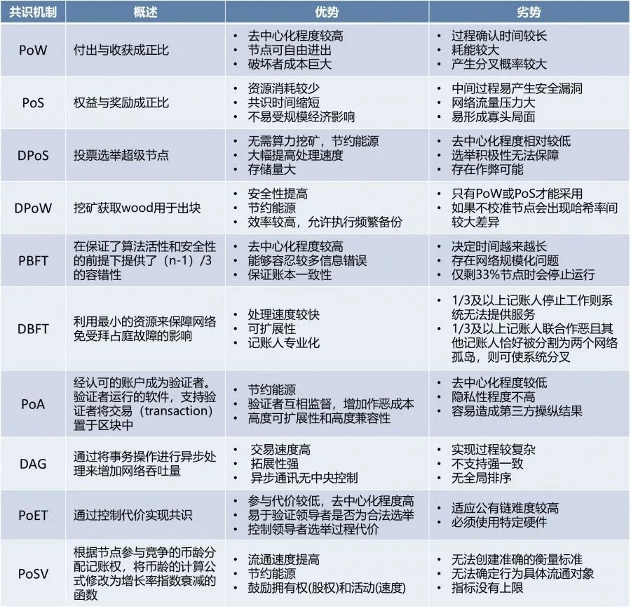

## 1. 什么是区块链
   - 从本质上讲
      ```
        区块链是一个分布式的共享数据库(在虚拟货币中体现为分布式账本)，存储于其中的数据或信息
        具有“不可伪造”“全程留痕”“可以追溯”“公开透明”“集体维护”等特征
        基于这些特征，区块链技术奠定了坚实的“信任”基础和可靠的“合作”机制
      ```
   - 形象地讲，区块链是有数据区块相连所形成的的数据块链。
     
   - 从数据结构点的角度进行类比，其类似逆向的链表，但不是通过地址连接，而是通话区块的hash值连接，前一个区块的hash值会被记录在其后区块的数据头中
     
## 2. 区块中都有什么 
1. 区块头 - (不同链的实现不同)
   - 父区块hash
   - 当前区块hash
   - 当前块号
   - nounce
   - 等...
    
2. 区块体
   - 交易数据列表

## 3. 区块之间怎么链接起来的
   - 下一个区块头中会包含前置区块的hash值 
## 4. 区块是怎么形成的
   - 由矿工对当前未打包的交易进行打包(即记账)，并由将区块扩散到P2P网络中进行验证，达成一致性共识
## 5. 区块链的核心技术
1. 分布式与去中心化
2. 密码学
   - 非对称加密
     - 公钥: 公开作为账户地址，他人可通过公钥进行签名验证，以确保数据的防篡改性（可以想象为银行卡号）
     - 私钥: 自己保存，用于生成交易或打包区块时进行签名（可以想象为银行卡密码）
   - 数字摘要
     - 针对某份数据获取的hash值
   - 数字签名
     - 发出者使用私钥对数据摘要进行加密获取数字签名
     - 接收者可以通过收到的数据进行hash获取数据摘要
     - 接收者通过发出者的公钥对数字签名进行解密获取发出者的数据摘要
     - 接收者对比自己计算的数据摘要和解密出的数据摘要是否相同
3. 共识机制
4. 博弈论
   1. hash正向容易
     ```python
     >>> import hashlib
     >>> hash = hashlib.sha256('test'.encode('utf8'))
     >>> hash.hexdigest()
     '9f86d081884c7d659a2feaa0c55ad015a3bf4f1b2b0b822cd15d6c15b0f00a08'
     ```
   2. hash逆向困难
     ```shell
     # 无奖竞猜
     146294f65f4cbb9212e43d284b8bfb05155270bde9b1c5113405b2b68408853a
     ```
   3. hash难题
     ```
      比特币中要求矿工打包的区块符合如下标准
      通过填充区块中的nounce字段来保证: 区块hash的前N位必须是0
      其中N随时间推移不断增大
     ```
   4. 概率安全
     ```
      恶意改变当前块数据则必须重新计算当前及后续所有块的hash值
      这样会导致作恶成本成倍上升淹没其作恶所得收益
      在比特币中，假如以全网10%的算力作恶，连续修改已经存在的最新的6个区块成功的概率为0.000248%
      在现实中基本可以认为是不可能事件
     ```
## 6. 拜占庭容错
   1. 主要解决的是开放环境中的信任问题
   2. 非拜占庭容错: Paxos、Raft
      - 适用于可信的、封闭的分布式环境
      - 能容忍部分节点故障，不能容忍节点作恶
      - 效率较高
   3. BFT - Byzantine Fault Tolerant
      - 适用于不可信的、开放的分布式环境
      - 能容忍部分忍节点故障和作恶
      - 少数服从多数
      - 效率较低
## 7. 共识机制
#### 概念
   - 分布式账本正常运行的核心规则

#### 作用
   - 解决信任问题，决定新区块的生成和维护
   - 用于解决人与人间的信任问题
   - 用于决定在区块链系统中谁负责生成新区块并维护有效统一

#### 本质上
  ```
  是在非信任环境下的分布式一致性算法
  ```
#### 详情
```
   所谓“共识机制”，是通过特殊节点的投票，在很短的时间内完成对交易的验证和确认；
   对一笔交易，如果利益不相干的若干个节点能够达成共识，我们就可以认为全网对此也能够达成共识。
   再通俗一点来讲，如果中国一名微博大V、美国一名虚拟币玩家、一名非洲留学生和一名欧洲旅行者互不相识，
   但他们都一致认为你是个好人，那么基本上就可以断定你这人还不坏。
```
```
   共识机制就是所有记账节点之间怎么达成共识，去认定一个记录的有效性，这既是认定的手段，也是防止篡改的手段。
   区块链的共识机制具备“少数服从多数”以及“人人平等”的特点，其中“少数服从多数”并不完全指节点个数，也可以是计算能力、股权数或者其他的计算机可以比较的特征量。
   “人人平等”是当节点满足条件时，所有节点都有权优先提出共识结果、直接被其他节点认同后并最后有可能成为最终共识结果。
   以比特币为例，采用的是工作量证明，只有在控制了全网超过51%的记账节点的情况下，才有可能伪造出一条不存在的记录。
   当加入区块链的节点足够多的时候，这基本上不可能，从而杜绝了造假的可能。
```
#### 工作量证明机制（PoW）PoW  
     - 缺点: 资源消耗非常大
     - 缺点: 去中心化程度低

#### 权益证明机制（PoS）PoS

   - 简介
        ```
        权益证明机制根据每个节点拥有代币的比例和时间，依据算法等比例地降低节点的挖矿难度，从而加快了寻找随机数的速度。
        这种共识机制可以缩短达成共识所需的时间，但本质上仍然需要网络中的节点进行挖矿运算。
        ```
   - 缺点: 去中心化程度低
   - 缺点: 挖矿资源消耗仍较大

#### 股份授权证明机制（DPoS）- DelegatedProof-of-Stake

   - 简介: 
        ```
            - 全体节点投票选举出一定数量的节点代表，由他们来代理全体节点确认区块、维持系统有序运行
            - 全体节点可以通过投票让现任节点代表失去代表资格，重新选举新的代表，实现实时的民主
            - DPoS是在PoS基础上产生的，在PoS机制下，持有通证数少的人很少有机会当选记账者
            - 代表节点轮流进行记账从而获得分红，并将节点获得记账（挖矿）总收入的一部分作为报酬，分给投票的用户
            - 投票的权重和分配的收益，都是按照持有的加密通证数量占总量的百分比来计算的，51%的股东的投票结果是不可逆且有约束力的
            - DPoS机制类似于现实中股份制公司，普通股民并不能进入董事会参与公司的管理，就要通过投票选举代表组成董事会，
            - 根据投票权重选举出能代表他们权益的人，进行公司管理，在区块链中，就是选举出代理人来记账
        ```
   - 优点: 大大缩小参与验证和记账节点的数量，记账效率高, 可达到秒级的共识验证
   - 缺点: 减弱了去中心化的程度，由选出的代表进行记账，存在一定的中心化控制


#### PoET
   - 基于消逝时间量的共识机制（POET）
   - 依赖Intel特殊硬件的可信执行环境
   - PoET现在是Hyperledger Sawtooth模块化框架的首选共识模型

#### Algorand - 自称突破了「公链不可能三角」
   - 核心: 可验证随机函数
   - 简介: 
        ```
        通过可验证随机函数(VRF)随机选择区块的生产者和验证者，一旦得知被选中，生产者或验证者只需广播一个简短的消息即可证明自己的身份。
        每产生一个新区块在网络中需要交换的消息不会随着用户数的增大而改变，因此即使用户规模增大，系统仍可保持较高的TPS 。
        Algorand 的 TPS 是比特币的 125 倍
        ```

   
   

## 币圈有风险，投资须谨慎

## 参考:
- 《区块链技术及应用》 清华大学出版社
- 《区块链原理、设计与应用 第2版》 机械工业出版社
- Consensus Algorithms: The Root Of Blockchain Technology - https://101blockchains.com/consensus-algorithms-blockchain
- 主流共识算法 - https://blog.csdn.net/Blockchain_lemon/article/details/84801413
