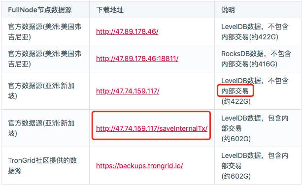
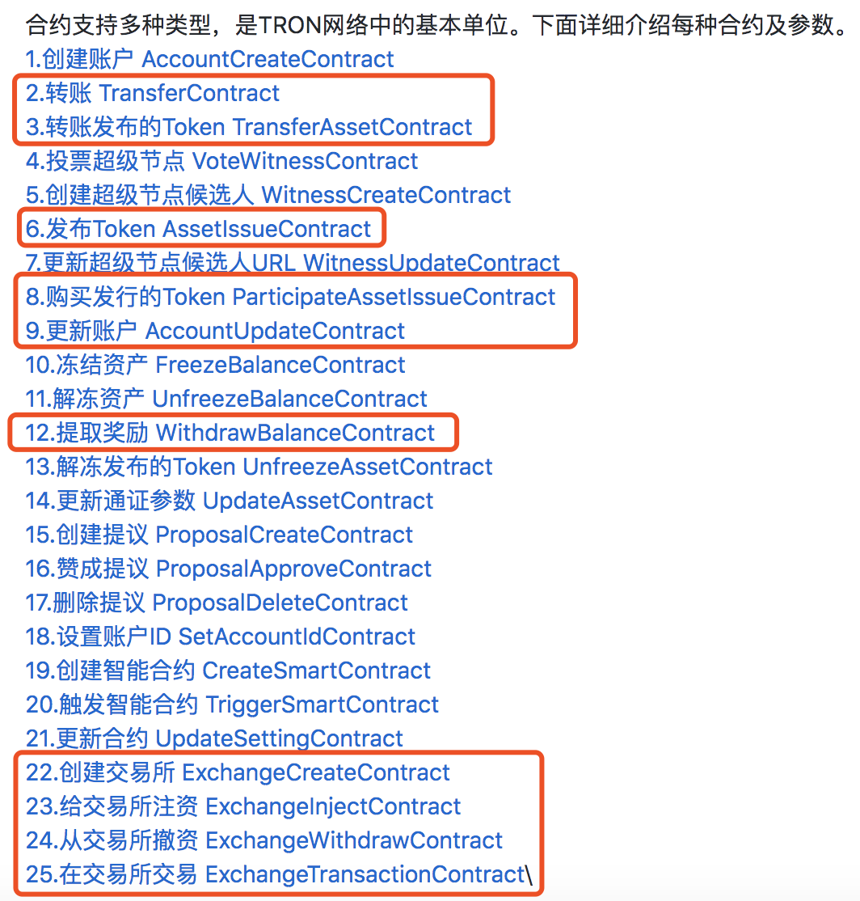
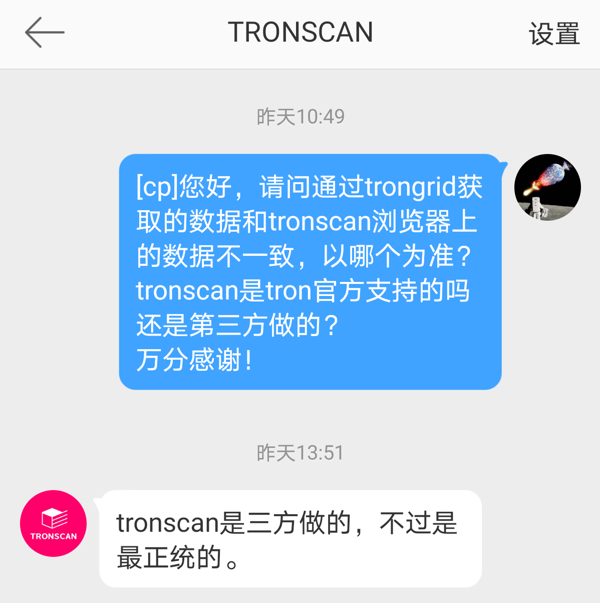

# 一. 全量数据的获取

### 1. 获取波场最新的FullNode数据快照
- https://cn.developers.tron.network/docs/%E6%95%B0%E6%8D%AE%E5%BA%93%E5%BF%AB%E7%85%A7%E5%A4%87%E4%BB%BD
  
- 目前不确定内部交易的确切含义（此处需请教时主任），为保证数据完整性，选择602G的数据源

### 2. 将数据快照解压到本地
- 遇到的问题:
  ```
  1. 文件过大，网速和磁盘都不满足需求
  2. 目前网速10-20M/s,且不同时段不稳定，全部下载完成约5天时间
  3. 使用的服务器磁盘只够下载压缩包，解压之后存储空间不足，已新购4T磁盘
  ```

### 3. 关于内部交易和合约类型
- 官网目前没有内部交易的明确定义
- 目前猜想内部交易的部分合约类型可能对交易流水分析没有影响
- 内部交易的非官方解释
    https://news.huoxing24.com/20190701151510214996.html

### 4. 合约类型的官方定义
- 下图中标红的合约类型为和资金交易相关的合约
- https://github.com/tronprotocol/documentation/blob/master/%E4%B8%AD%E6%96%87%E6%96%87%E6%A1%A3/%E6%B3%A2%E5%9C%BA%E5%8D%8F%E8%AE%AE/%E4%BA%A4%E6%98%93%E6%93%8D%E4%BD%9C%E7%B1%BB%E5%9E%8B%E8%AF%B4%E6%98%8E.md
  


# 二. 全量数据的解析

### 1. 安装leveldb、plyvel
- leveldb的有一个限制是只能单进程访问(可以多线程)
- 因此处理大数据量时(602G全量数据中trans数据约占一半约300G)性能会比较慢

### 2. 关于protobuf存储格式
- 目前leveldb中存储的都是以protobuf进行序列化的数据
- 具体的proto接口定义如下: 
https://github.com/tronprotocol/java-tron/tree/develop/protocol/src/main/protos
- 安装protobuf及python SDK
- 编译生成pb2.py接口文件

### 3. 通过plyvel读取并解析trans库数据
- trans 中的每条数据中会有不同的合约类型
- 不同的合约类型需要根据不同的结果进行解析

### 4. 将解析好的transaction形成关系表结构写入oushudb
- 需要根据业务逻辑设计流水关系表结构 (业务须咨询时主任)
- 以txId为主键，尽量以blockId进行分区
  
# 三. Transaction数据的实时更新

### 1. 中间数据补全
- 使用官方推荐的API SDK https://github.com/iexbase/tron-api-python
- 根据全量数据的最新block num为基准，获取并补全其后的trans数据

### 2. 数据持续更新
- 保存当前的blockId，以一定时间间隔轮询block并解析交易数据插入到oushudb中

# 四. 后续验证工作

### 1. 全量数据的验证
- 目前只下载了Lite FullNode的最小数据进行解析验证，结构可以正确解析，但得到的结果和在tronscan官网的不一致
- 需要使用20210425的 FullNode 全量快照数据进行验证

### 2. 频繁请求会否被屏蔽
- 需要长时间验证
### 3. block及trans数据一致性核验
- block中也不含trans数据，需要和trans库中的进行核验，且需要找到对应关系
### 4. 关于匿名合约
- 匿名合约在数据库中是否匿名
- 匿名合约在实时获取接口中无法获取不匿名信息
- 匿名合约如何分析

# 五. 数据一致性及准确性

- 1. 使用API 在 https://api.trongrid.io获取的block数据，与tronscan上查出的结果不一致
- 2. 100G的全量数据上解析的数据也与tronscan上的不一致
- 3. 不过，trongrid上的数据与fullnode 100G数据一致（根据block进行验证）
- 4. 官方解释
    