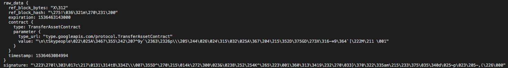

# 一. 全量数据的获取

### 1. 获取波场最新的数据快照
- 总数据约600G
  

### 2. 将数据快照解压到本地
### 3. 关于内部交易和合约类型
- 官网目前没有内部交易的明确定义
- 目前猜想内部交易的部分合约类型可能对交易流水分析没有影响

### 4. 合约类型的官方定义
- 下图中标红的合约类型为和资金交易相关的合约
  

# 二. 全量数据的解析

### 1. 安装对应的数据库SDK和package

### 2. 关于波场数据的存储格式
- 目前波场数据以特殊的格式进行了序列化
- 需要通过特定的格式进行反序列化
- 通过波场公链源代码获取各种主体的数据结构
- 不同合约的结构也需要做不同的处理
    
    
### 3. 通过python接口读取并解析trans库数据
- trans 中的每条数据中会有不同的合约类型
- 不同的合约类型需要根据不同的结果进行解析
  

### 4. 将解析好的transaction形成关系表结构写入oushudb
- 需要根据业务逻辑设计流水关系表结构 (业务须咨询时主任)
- 以txId为主键，尽量以blockId进行分区
  
# 三. Transaction数据的实时更新

### 1. 中间数据补全
- 调用用官方API获取数据快照和最新数据中间的数据差集
- 根据全量数据的最新block num为基准，获取并补全其后的trans数据

### 2. 数据持续更新
- 保存当前的blockId，以一定时间间隔轮询block并解析交易数据插入到oushudb中
  

# 四. 后续验证工作

### 1. 全量数据的验证
- 需要使用20210425的 数据快照 全量快照数据进行验证

### 2. 频繁请求会否被屏蔽
- 需要长时间验证
  
### 3. 关于匿名合约
- 匿名合约在数据库中是否匿名
- 匿名合约在实时获取接口中无法获取不匿名信息
- 匿名合约如何分析